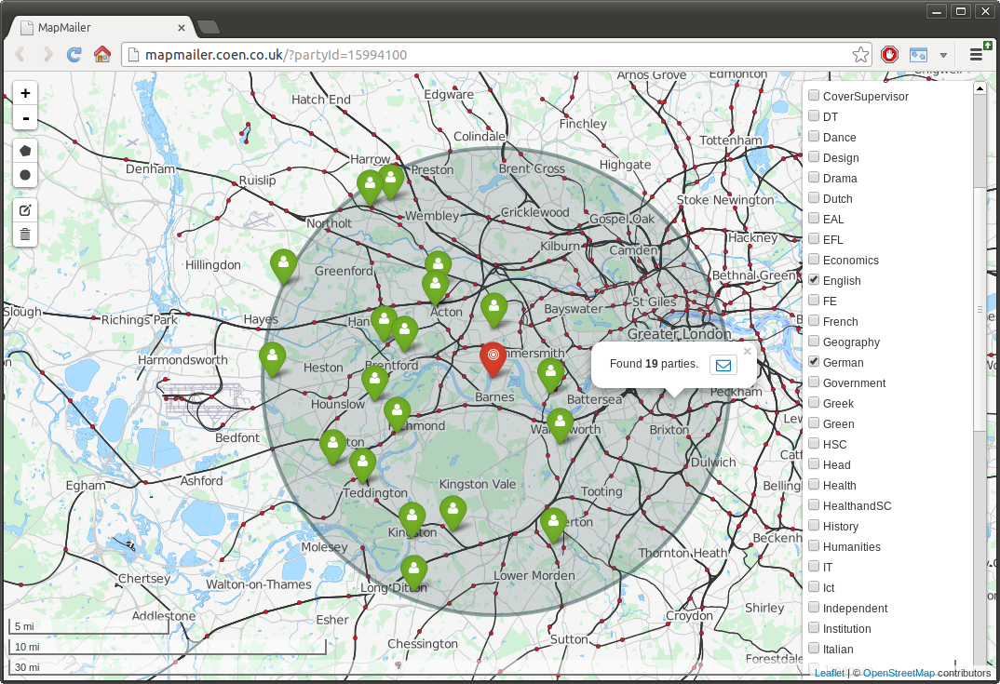
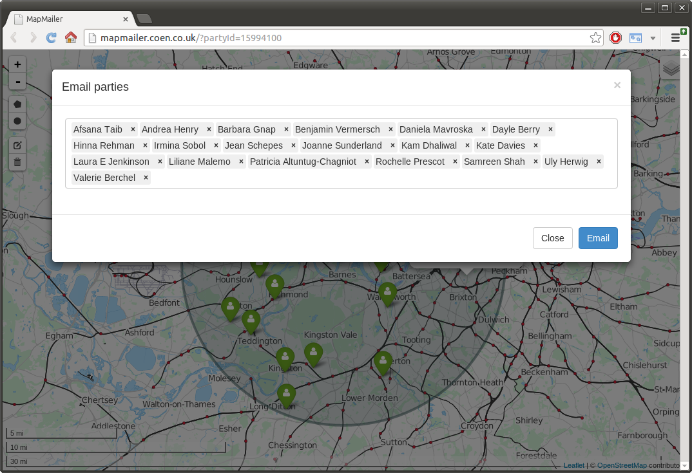
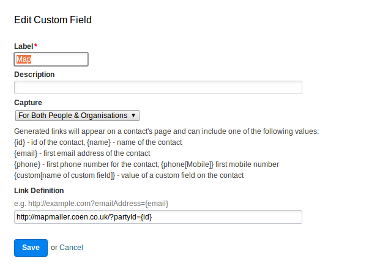

mapmailer [](https://travis-ci.org/analytically/mapmailer)
=========

Email CRM contacts by drawing an area on a map (UK). Built using [Play Framework 2.3](http://www.playframework.org) (Scala).
Follow [@analytically](http://twitter.com/analytically) for updates. Check the video [here](https://www.youtube.com/watch?v=KkWUCm6CSBM)!




Works with:
  - [Capsule CRM](http://www.capsulecrm.com/)

#### Requirements

[Java 7](http://java.com/en/download/index.jsp) or later. [MongoDB](http://www.mongodb.org) at localhost:27017. A Capsule CRM account and token.

#### Building (optional)

Requires [Play Framework 2.3](http://www.playframework.com/).

```
play assembly
```

This builds a single, executable 'fat' jar: `target/scala-2.10/mapmailer.jar`.

#### Running

Prebuilt releases are available [here](https://github.com/analytically/mapmailer/releases).

Capsule CRM users can find their API token by visiting `My Preferences` via their username menu in the Capsule navigation bar.
See [application.conf](conf/application.conf) for more configurable options. In order to group your contacts, you need to add tags
(e.g. 'Customer' or 'VIP'). For persons the job title field (comma separated) will also be used as groups (e.g. 'CTO, Customer').
New and modified contacts should appear after 5-10 minutes.

Download and copy the [CodePoint Open CSV](https://www.ordnancesurvey.co.uk/opendatadownload/products.html) (scroll halfway down, about 20 MB)
files to the `codepointopen` directory in the same directory with the downloaded jar.

Start the application:

```
java -Dcapsulecrm.url=https://example.capsulecrm.com -Dcapsulecrm.token=abcdef123456789 -jar mapmailer.jar
```

After all CodePoint Open files are imported and processed, they are moved to the `codepointopen/done` directory.

Then visit [http://localhost:9000](http://localhost:9000) and you should see the map.

#### Capsule CRM Custom Field

Use a custom field to have a direct link from your contact to the map. In Capsule CRM, go to `Settings` > `Custom Field Settings: for People & Organisations` > `Add new...` > `Generated Link` and use your server in `Link Definition` appended with `?partyId={id}`, for example:



#### Technology

* [Play Framework 2.3](http://www.playframework.org) with [Scala](http://www.scala-lang.org/)
* [Apache Camel](http://camel.apache.org) to [process and monitor](https://github.com/analytically/mapmailer/blob/master/app/Global.scala#L34) the `codepointopen` directory and to tell the actors about the postcodes
* [Akka](http://akka.io) provides a nice concurrency model [to process the 1.7 million postcodes](https://github.com/analytically/mapmailer/blob/master/app/actors/actors.scala#L41) in under one minute on modern hardware
* [MongoDB](http://www.mongodb.org) as database with two-dimensional geospatial indexes (see [Geospatial Indexing](http://www.mongodb.org/display/DOCS/Geospatial+Indexing))
* [ReactiveMongo](http://reactivemongo.org/) is a Scala MongoDB driver that provides fully non-blocking and asynchronous I/O operations
* [Bootstrap](http://getbootstrap.com/), [Font Awesome](http://fortawesome.github.com/Font-Awesome/) and [Handlebars](http://handlebarsjs.com/)

Geo:

* [GeoTools](http://www.geotools.org) converts the CodePoint Open eastings/northings to latitude/longitude
* [Leaflet](http://leafletjs.com/) for the map
* [Leaflet Draw](https://github.com/Leaflet/Leaflet.draw)
* [Leaflet awesome-markers plugin](https://github.com/lvoogdt/Leaflet.awesome-markers)
* [Thunderforest](http://www.thunderforest.com/) transport map

CRM:

* [Unofficial Capsule CRM API Java Client](https://github.com/analytically/capsulecrm-java) - depends on
  [Async Http Client](https://github.com/AsyncHttpClient/async-http-client), [Google Guava](https://code.google.com/p/guava-libraries/),
  [XStream](http://xstream.codehaus.org/) and [Joda-Time](http://www.joda.org/joda-time/).

#### Background and usecase

This software was built for [Coen Recruitment](http://www.coen.co.uk/), an education recruitment agency in the UK. Since
they prioritise on location and endeavour to find teachers work close to home, their consultants need map area selection
to market teachers to schools efficiently. Parts of this project are based on [CamelCode](https://github.com/analytically/camelcode).

#### License

Licensed under the [Apache License, Version 2.0](http://www.apache.org/licenses/LICENSE-2.0).

Copyright 2014-2015 [Mathias Bogaert](mailto:mathias.bogaert@gmail.com).

This data contains Ordnance Survey data &copy; Crown copyright and database right 2013. Code-Point Open contains
Royal Mail data &copy; Royal Mail copyright and database right 2012. Code-Point Open and ONSPD contains National Statistics
data &copy; Crown copyright and database right 2013.

OS data may be used under the terms of the [OS OpenData licence](http://www.ordnancesurvey.co.uk/oswebsite/docs/licences/os-opendata-licence.pdf).